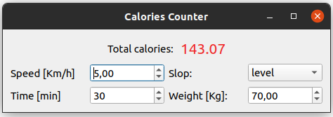

# caloriesCalculator_using_Qt

A graphical calories calculator/counter. The user needs to input only four parameters as follows:
    
    - Speed in kilometers per hour: the speed of the person while walking or running.
    - Time in minutes: the period of activity in minutes.
    - Weight in kilograms: the current weight of the person.
    - Slop: the slop of the surface that the person is using. 

The calculator provides a total number of calories according to [shapesense.com](https://www.shapesense.com/fitness-exercise/calculators/walking-calorie-burn-calculator.shtml).

## How to build 
The program can be built and run using Qt5 Creator. 